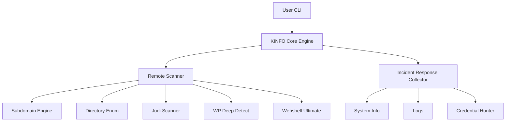

# 🧠 **KINFO v1.4 — Advanced Incident Response & Pentest Toolkit**  
*Premium Edition — Enterprise-Grade Documentation*


## 🎯 Ringkasan Eksekutif
**KINFO v1.4** adalah toolkit respons insiden, OSINT, dan pemindaian keamanan yang dirancang untuk CSIRT, pentester, dan administrator server.

## 📦 Fitur Utama
### Remote Security Scanner
- Subdomain Engine v1.4  
- Reverse IP Multi-source  
- Webshell Finder Ultimate  
- WordPress Deep Detect  
- Judi/Slot Deep Scanner  

### Local Incident Response Mode
Mengumpulkan artefak lengkap: system info, cron, network, log, disk, credential hunter, dan hashes.

## Diagram Arsitektur (Mermaid)


## Cara Penggunaan
```
bash kinfo.sh
bash kinfo.sh --subdomain example.com
bash kinfo.sh --revip 1.2.3.4
bash kinfo.sh --ir
```

## Struktur Output
```
outputkinfo/
└── 2025-11-27_21-32-02/
    ├── system/
    ├── subdomain/
    ├── reverseip/
    ├── webshell/
    ├── wp-scan/
    ├── judi-scan/
    └── summary.txt
```

## Changelog v1.4
- Integrasi IR Collector  
- Subdomain Engine improved  
- Webshell Ultimate DB  
- Reverse IP Multi-source  
- WP Deep Detect upgrade  
- Deep judi/slot path generator  

## Pengembang
Saeful Bahri — CSIRT Diskominfo Subang

## Lisensi
MIT License
