# 🧠 **KINFO v1.4 — Incident Response & Pentest Toolkit**  
*Premium Edition — Enterprise-Grade Documentation*


> **KINFO** adalah toolkit respons insiden, OSINT, dan pemindaian keamanan berbasis CLI untuk tim **CSIRT**, **administrator server**, dan **pentester profesional**.  
> Versi 1.4 menghadirkan peningkatan besar pada modul *Remote Scanner*, *Incident Response Collector*, serta akurasi deteksi artefak keamanan.

---

## 🆕 **Pembaruan Besar Versi 1.4**

| Fitur / Modul | Pembaruan v1.4 | Peningkatan Utama |
|--------------|----------------|------------------|
| **Subdomain Engine v1.4** | Multi-engine + wildcard detection + resolver cerdas | Akurasi meningkat, false-positive menurun |
| **Webshell Finder Ultimate** | Massive DB + heuristik nama mencurigakan | Deteksi webshell jauh lebih efektif |
| **WP Deep Detect** | Enumerasi user, plugin, brute endpoint scan | Analisis WordPress yang lebih mendalam |
| **Reverse IP Multi-source** | Kombinasi beberapa API OSINT | Data domain lebih lengkap |
| **Judi/Slot Deep Scanner** | Deep path generator + smart wordlist | Deteksi slot/judi lebih agresif |
| **IR Collector v1.4** | Artefak sistem lengkap + hashing + log parser | Ideal untuk forensik cepat |
| **Credential Hunter** | ENV & config scanner | Kebocoran key/token terdeteksi otomatis |
| **Output Manager v2.0** | Struktur folder premium + JSON siap SIEM | Integrasi mudah ke Wazuh/ELK |

---

## 📦 **Instalasi**

```bash
git clone https://github.com/kangaman/kinfo.git
cd kinfo
chmod +x kinfo.sh
```

**Dependensi wajib:**
```
curl, jq, grep, awk, sed, dig, wget
```

**Dependensi opsional:**
```
nmap, whois, ss/netstat, ftp, parallel
```

---

# 🎛️ **Penggunaan**

## Mode Interaktif
```
./kinfo.sh
```

## Mode Non-Interaktif

### Subdomain v1.4
```
./kinfo.sh --module subdomain -t example.com
```

### Reverse IP Multi-source
```
./kinfo.sh --module reverseip -t 1.2.3.4
```

### Incident Response
```
./kinfo.sh --module ir
```

### WP Deep Detect
```
./kinfo.sh --module wp -t https://example.com
```

---

# 🧭 **Struktur Modul (v1.4)**

## 🌐 Remote Scanner

| Kode | Modul | Deskripsi |
|------|--------|-----------|
| R1 | subdomain | Multi-engine subdomain discovery v1.4 |
| R2 | direnum | Directory enumeration bertingkat |
| R3 | ftpbrute | FTP brute force |
| R4 | judi | Slot/Judi Deep Scanner |
| R5 | reverseip | Reverse IP multi-source |
| R6 | extract | Header check & domain extractor |
| R7 | webscan | Webshell Finder Ultimate |
| R8 | envscan | ENV & config credential leak checker |
| R9 | wpcheck | WP Deep Detect |
| R10 | zoneh | Grab domain dari Zone-H |

---

## 💻 Local Incident Response (IR v1.4)

| Kode | Modul | Fungsi |
|------|--------|--------|
| L1 | filescan | Pendeteksi webshell lokal |
| L2 | localps | Analisis proses mencurigakan |
| L3 | localnet | Koneksi jaringan aktif |
| L4 | localusers | Audit user & login history |
| L5 | localcron | Analisis cron job lengkap |
| L6 | ftpclient | FTP shell mini |
| L7 | collectdata | Sistem artefak forensik lengkap |

---

# 🧩 **Detail Modul IR Collector v1.4 (Lengkap)**

IR Collector kini mencakup kumpulan artefak tingkat sistem:

### **📁 System Profiling**
- OS, kernel, hostname  
- CPU, RAM, load average  
- Uptime & reboot history  

### **🧵 Process / Service**
- Process tree (pstree)  
- High-CPU procs  
- Service status  
- Malware-pattern hunting  

### **🌐 Network Capture**
- Established/Listen ports  
- Suspicious foreign endpoints  
- Reverse-DNS check otomatis  

### **🕒 Cron & Scheduled Tasks**
- Semua cron user  
- Cron root & system  
- Timer/service schedules  

### **🔐 Credential Hunter**
- ENV leakage  
- `.env` scanning  
- File config dengan pola API-key/token/password  

### **🪵 Log Collector**
- `/var/log/auth.log`  
- Syslog  
- Webserver logs (nginx/apache)  
- Deteksi anomali login  

### **🧱 File Integrity**
- Hashing file sensitif (SHA256)  
- Permission anomaly  

### **📦 Output**
Semua artefak tersusun rapi di:

```
outputkinfo/<timestamp>/system/
outputkinfo/<timestamp>/logs/
```

---

# 🗂️ **Struktur Output v1.4**

```
outputkinfo/
└── 2025-11-27_21-32-02/
    ├── system/
    ├── subdomain/
    ├── reverseip/
    ├── webshell/
    ├── wp-scan/
    ├── judi-scan/
    ├── env/
    └── summary.txt
```

---

# 🗺️ **Diagram Arsitektur Sistem (Mermaid)**

```mermaid
flowchart TD
    A[User CLI] --> B[KINFO Core Engine]

    B --> C1[Remote Scanner]
    B --> C2[Incident Response Collector]

    C1 --> D1[Subdomain Engine v1.4]
    C1 --> D2[Directory Enum]
    C1 --> D3[Judi Deep Scanner]
    C1 --> D4[WP Deep Detect]
    C1 --> D5[Webshell Ultimate]

    C2 --> E1[System Profiling]
    C2 --> E2[Log Collector]
    C2 --> E3[Credential Hunter]
    C2 --> E4[Hashing System Files]

    B --> O[Output Manager → JSON / TXT / Folder Structure]
```



---

# 📘 **Use Case**

### **1. Audit Keamanan Web Pemerintah**
- Subdomain enumeration  
- WP Deep Detect  
- Webshell scanning  
- Header security evaluation  

### **2. Incident Response Pasca-Insiden**
- IR Collector → artefak lengkap  
- Hashing file sensitif  
- Log parsing untuk timeline  

### **3. Baseline Keamanan Server**
- Collectdata JSON → integrasi SIEM  
- Cron & process auditing  

### **4. Pentest OSINT**
- Reverse IP multi-source  
- Zone-H domain grabber  

---

# 🧠 Tips Operasional

- Gunakan format JSON untuk integrasi SIEM  
- Jalankan sebagai root untuk IR mode  
- Simpan output dalam repositori insiden  
- Gunakan wordlist kustom untuk judi/webshell  

---

# 🛠️ Troubleshooting

| Masalah | Penyebab | Solusi |
|--------|----------|--------|
| Dependensi hilang | jq/curl/dig tidak terpasang | Install melalui apt/yum |
| Output kosong | Target invalid | Gunakan domain/IP valid |
| Permission denied | Tidak dijalankan sebagai root | Jalankan: `sudo su` |
| Tidak bisa menulis output | Izin folder | `chmod -R 755 outputkinfo` |

---

# 📜 Lisensi

**MIT License — 2025 © Saeful Bahri**
Bebas digunakan, dimodifikasi, dan dikembangkan — selama mencantumkan kredit pembuat asli.

---

# 👨‍💻 Pengembang

- **Saeful Bahri** — Pengembang utama  
- Referensi pengembangan `collectdata`: [adpermana (GitHub)](https://github.com/adpermana)  

> “KINFO 1.4: Lebih Cerdas, Lebih Cepat, Lebih Dalam”
